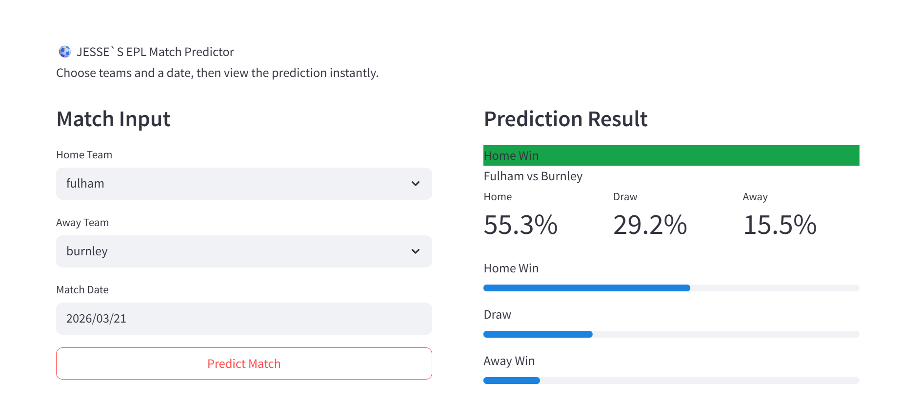
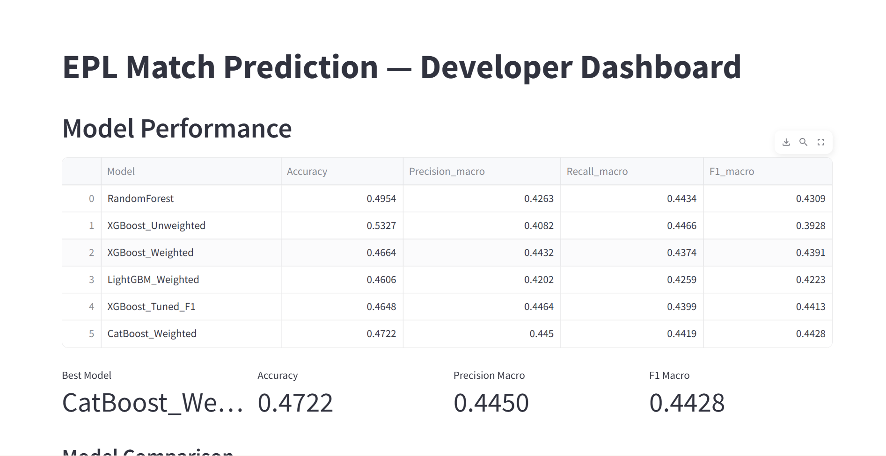
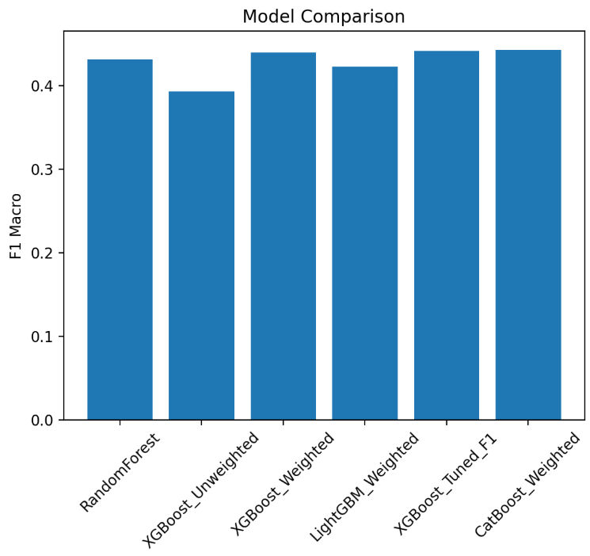
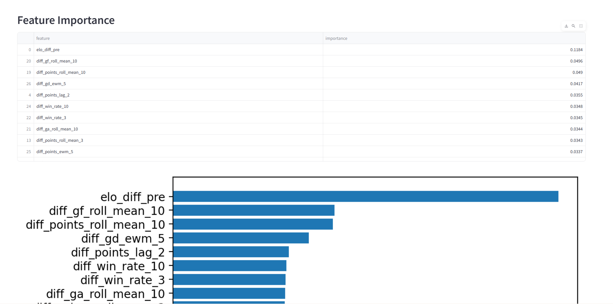

# EPL Match Prediction System

End-to-end machine learning system for predicting English Premier League match outcomes using historical football data, feature engineering, and multiple machine learning models.

The system predicts:

* Home Win
* Draw
* Away Win

This project includes:

* Full ML pipeline
* FastAPI backend
* Streamlit user prediction app
* Streamlit developer monitoring dashboard
* Database integration
* Planned automated weekly retraining

## Project Overview

This project builds a complete  machine learning system for predicting English Premier League match outcomes.

The system:

* Loads historical EPL data (2009–Present)
* Cleans and preprocesses match data
* Engineers predictive features
* Trains multiple models
* Evaluates model performance
* Selects best model
* Serves predictions via FastAPI
* Displays predictions via Streamlit UI
* Monitors model performance via dashboard

## Data Source

Historical EPL data was sourced from:

https://football-data.co.uk/

Workflow:

* Download season-level EPL CSV files
* Concatenate multiple seasons (2009–present)
* Clean and standardize columns
* Load into MySQL database
* Use pipeline for feature engineering and training

A sample dataset is included in:

`sample_dataset/epl-historical-data.csv`

This sample shows the structure of the dataset used.

## Features

### Feature Engineering

The project uses advanced football-specific features.

#### Time Series Features

* Lag features
* Rolling averages
* Team form indicators
* Win rates
* Exponential moving averages

#### Elo Rating Features

* Team strength ratings
* Season reset logic
* Home advantage adjustment
* Dynamic rating updates

#### Difference Features

* Home vs away team comparison
* Strength differential features

## Machine Learning Models

The following models are trained and compared:

* Random Forest
* XGBoost
* LightGBM
* CatBoost
* Tuned XGBoost

## Evaluation Metrics

Models are evaluated using:

* Accuracy
* Precision (Macro)
* Recall (Macro)
* F1 Score (Macro)
* Confusion Matrix

Best model is automatically selected.

## Project Structure

```bash
epl_prediction/
│
├── app/
│   ├── config.py
│   ├── data_loader.py
│   ├── database.py
│   ├── dataset_builder.py
│   ├── evaluation.py
│   ├── feature_engineering.py
│   ├── model_io.py
│   ├── predictor.py
│   ├── preprocessing.py
│   └── trainer.py
│
├── dashboard/
│   └── app.py
│
├── epl_api/
│   └── epl_main.py
│
├── models/
│
├── sample_dataset/
│   └── epl-historical-data.csv
│
├── screenshots/
│   ├── dashboard_1.png
│   ├── dashboard_2.png
│   ├── dashboard_3.png
│   └── user_app.png
│
├── ui/
│   └── user_app_local.py
│   └── user_app_deploy.py
│
├── .env
├── requirements.txt
├── run_pipeline.py
└── README.md
```

## Applications

### User Prediction App

Location:

`ui/user_app_local.py`

This was for testing when deploying

Features:

* Select home team
* Select away team
* Select match date
* Get prediction probabilities
* View prediction result

`ui/user_app_deploy`

This version is optimized for deployment, allowing external users to access the application online without requiring the FastAPI backend

Features:

* Select home team
* Select away team
* Select match date
* Get prediction probabilities
* View prediction result

### Developer Dashboard

Location:

`dashboard/app.py`

Features:

* Model performance metrics
* Model comparison
* Feature importance
* Model artifacts monitoring

### FastAPI Backend

Location:

`epl_api/epl_main.py`

Features:

* Prediction endpoint
* Team list endpoint
* Model serving

## Screenshots

### User Prediction App



### Developer Dashboard








## Model Training Pipeline

Run the pipeline:

```bash
python run_pipeline.py
```

Pipeline steps:

1. Load data from database
2. Clean dataset
3. Feature engineering
4. Build dataset
5. Split data (time-based)
6. Train models
7. Evaluate models
8. Select best model
9. Save model artifacts

## Run Locally

### Install Dependencies

```bash
pip install -r requirements.txt
```

### Setup Environment Variables

Create `.env`:

```env
MYSQL_HOST=
MYSQL_PORT=
MYSQL_USER=
MYSQL_PASSWORD=
MYSQL_DATABASE=
MYSQL_TABLE=
```

### Run Training Pipeline

```bash
python run_pipeline.py
```

### Start FastAPI

```bash
uvicorn epl_api.epl_main:app --reload
```

### Run User App

```bash
streamlit run ui/user_app_local.py
```

### Run Developer Dashboard

```bash
streamlit run dashboard/app.py
```

## Planned Improvements

Future upgrades:

* Automated data scraping (every Monday)
* Weekly model retraining
* Model version tracking
* Model performance logging
* Automatic best model selection
* Model deployment automation

Workflow:

1. Scraper collects new match data
2. Data loaded into database
3. Models retrained
4. Metrics calculated
5. Best model selected
6. Production model updated

## Model Lifecycle

Each retraining cycle:

* Save trained models
* Save training date
* Save evaluation metrics
* Save best model
* Deploy best model

## Tech Stack

* Python
* Pandas
* NumPy
* Scikit-learn
* XGBoost
* LightGBM
* CatBoost
* FastAPI
* Streamlit
* MySQL
* Joblib
* Matplotlib

## Future Improvements

* Docker deployment
* Cloud deployment
* CI/CD pipeline
* Automated retraining
* Live data integration
* More leagues support

## Portfolio Purpose

This project demonstrates:

* End-to-end ML pipeline design
* Feature engineering
* Model training and tuning
* Model evaluation
* API development
* Dashboard development
* Deployment readiness

## Author

Jesse

EPL Match Prediction Project
Machine Learning Portfolio Project
